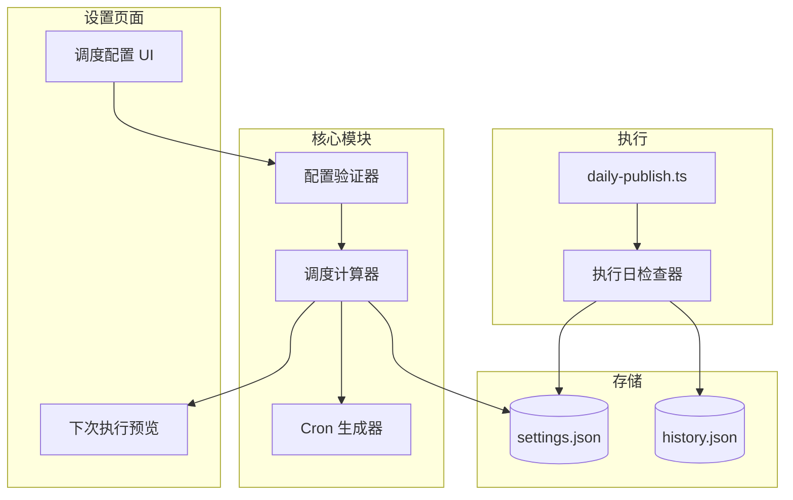

# 设计文档

## 概述

本功能扩展现有的定时发布系统，支持更灵活的任务调度频率配置。核心改进包括：

1. **多种调度模式**: 支持每日、间隔天数、每周指定日期三种模式
2. **多时间点执行**: 支持每天最多 3 个执行时间点
3. **智能 cron 生成**: 根据配置自动生成 GitHub Actions cron 表达式
4. **执行日检查**: 脚本执行前验证是否为有效执行日

## 架构



## 组件与接口

### 1. 调度配置类型 (`src/types/index.ts`)

```typescript
// 调度模式枚举
type ScheduleMode = 'daily' | 'interval' | 'weekly';

// 扩展的调度配置
interface ScheduleConfig {
  timezone: string;           // 时区，如 'Asia/Shanghai'
  mode: ScheduleMode;         // 调度模式
  executionTimes: string[];   // 执行时间点数组，如 ['08:00', '18:00']
  intervalDays?: number;      // 间隔天数（1-30），仅 interval 模式
  weekDays?: number[];        // 周执行日（1-7，1=周一），仅 weekly 模式
}

// 更新后的 Settings 接口
interface Settings {
  schedule: ScheduleConfig;
  content: {
    language: string;
    minLength: number;
    maxLength: number;
  };
}
```

### 2. 调度计算器 (`src/lib/scheduler.ts`)

```typescript
interface SchedulerConfig {
  schedule: ScheduleConfig;
  lastExecutionTime?: string;  // ISO 时间字符串
}

interface NextExecutionResult {
  nextTime: Date;              // 下次执行时间（用户时区）
  nextTimeUtc: Date;           // 下次执行时间（UTC）
  isValid: boolean;            // 配置是否有效
}

interface Scheduler {
  // 计算下次执行时间
  getNextExecutionTime(config: SchedulerConfig): NextExecutionResult;
  
  // 检查指定日期是否为有效执行日
  isValidExecutionDay(date: Date, config: SchedulerConfig): boolean;
  
  // 生成 cron 表达式
  generateCronExpression(schedule: ScheduleConfig): string[];
  
  // 验证调度配置
  validateScheduleConfig(schedule: ScheduleConfig): ValidationResult;
}

interface ValidationResult {
  valid: boolean;
  errors: string[];
}
```

### 3. 时区转换工具 (`src/lib/timezone.ts`)

```typescript
interface TimezoneConverter {
  // 将用户时区时间转换为 UTC
  toUtc(time: string, timezone: string): string;
  
  // 将 UTC 时间转换为用户时区
  fromUtc(utcTime: string, timezone: string): string;
  
  // 获取时区偏移量（小时）
  getTimezoneOffset(timezone: string): number;
}
```

### 4. API 路由更新

| 路由 | 方法 | 变更 |
|------|------|------|
| `/api/settings` | GET | 返回扩展的 schedule 配置 |
| `/api/settings` | PUT | 接受扩展的 schedule 配置，验证后保存 |
| `/api/settings/preview` | POST | 新增：计算并返回下次执行时间预览 |

### 5. 设置页面组件更新

```typescript
// 调度模式选择器
interface ScheduleModeSelector {
  value: ScheduleMode;
  onChange: (mode: ScheduleMode) => void;
}

// 执行时间点编辑器
interface ExecutionTimesEditor {
  times: string[];
  maxTimes: number;  // 最大 3 个
  onAdd: (time: string) => void;
  onRemove: (index: number) => void;
}

// 周执行日选择器
interface WeekDaySelector {
  selectedDays: number[];
  onChange: (days: number[]) => void;
}

// 下次执行预览
interface NextExecutionPreview {
  nextTime: string;      // 用户时区
  nextTimeUtc: string;   // UTC
  isValid: boolean;
}
```

## 数据模型

### 更新后的 Settings 结构

```typescript
// config/settings.json
{
  "schedule": {
    "timezone": "Asia/Shanghai",
    "mode": "interval",           // 新增：调度模式
    "executionTimes": ["08:00"],  // 更新：支持多时间点
    "intervalDays": 2,            // 新增：间隔天数
    "weekDays": [1, 3, 5]         // 新增：周执行日
  },
  "content": {
    "language": "zh-CN",
    "minLength": 1500,
    "maxLength": 2500
  }
}
```

### 更新后的 History 结构

```typescript
// data/history.json
{
  "articles": [...],
  "usage": {...},
  "lastExecutionTime": "2024-01-15T00:00:00Z"  // 新增：上次执行时间
}
```

## 正确性属性

*属性是一种应该在系统所有有效执行中保持为真的特征或行为——本质上是关于系统应该做什么的形式化陈述。属性作为人类可读规范和机器可验证正确性保证之间的桥梁。*

### Property 1: 调度配置往返一致性

**对于任意**有效的调度配置（包含 mode、executionTimes、intervalDays、weekDays），保存到 settings.json 后再读取，应返回与原始配置相同的数据。

**Validates: Requirements 1.2, 2.2, 3.2**

### Property 2: 执行日计算正确性

**对于任意**上次执行时间和间隔天数配置（1-30），计算的下次执行日期应等于上次执行日期加上间隔天数。

**Validates: Requirements 1.3, 6.4**

### Property 3: 执行日判断正确性

**对于任意**日期和调度配置：
- 当模式为 `daily` 时，任何日期都是有效执行日
- 当模式为 `interval` 时，仅当距离上次执行的天数是 intervalDays 的倍数时为有效执行日
- 当模式为 `weekly` 时，仅当日期的星期几在 weekDays 数组中时为有效执行日

**Validates: Requirements 2.3, 6.1**

### Property 4: 时区转换正确性

**对于任意**时间字符串和时区，从用户时区转换为 UTC 后再转换回用户时区，应得到原始时间。

**Validates: Requirements 4.2, 5.2**

### Property 5: Cron 表达式生成正确性

**对于任意**有效的调度配置：
- 生成的 cron 表达式应包含所有 executionTimes 对应的 UTC 时间
- 当模式为 `weekly` 时，cron 表达式应包含正确的星期几字段
- 当模式为 `interval` 且 intervalDays > 1 时，cron 应为每日执行

**Validates: Requirements 4.1, 4.4**

### Property 6: 下次执行时间计算正确性

**对于任意**有效的调度配置和当前时间，计算的下次执行时间应：
- 大于当前时间
- 符合调度模式的约束（正确的星期几或间隔天数）
- 时间点在 executionTimes 数组中

**Validates: Requirements 5.1**

### Property 7: 执行时间点数量限制

**对于任意**执行时间点数组，当数组长度超过 3 时，验证函数应返回错误。

**Validates: Requirements 3.1**

### Property 8: 间隔天数输入验证

**对于任意**间隔天数值，当值小于 1 或大于 30 时，验证函数应返回错误。

**Validates: Requirements 1.1**

## 错误处理

### 配置验证错误

```typescript
class ScheduleValidationError extends Error {
  constructor(
    message: string,
    public field: string,
    public value: unknown
  ) {
    super(message);
    this.name = 'ScheduleValidationError';
  }
}
```

### 错误场景

| 场景 | 错误类型 | 处理方式 |
|------|----------|----------|
| intervalDays 超出范围 | ScheduleValidationError | 显示错误提示，阻止保存 |
| weekDays 为空数组 | ScheduleValidationError | 显示错误提示，阻止保存 |
| executionTimes 超过 3 个 | ScheduleValidationError | 显示错误提示，阻止添加 |
| executionTimes 有重复 | ScheduleValidationError | 显示错误提示，阻止添加 |
| 无效的时间格式 | ScheduleValidationError | 显示错误提示，阻止保存 |
| 无效的时区 | ScheduleValidationError | 显示错误提示，阻止保存 |

## 测试策略

### 单元测试（Vitest）

1. **调度计算器** (`scheduler.ts`)
   - 下次执行时间计算
   - 执行日判断逻辑
   - cron 表达式生成

2. **时区转换** (`timezone.ts`)
   - UTC 转换
   - 时区偏移计算

3. **配置验证**
   - 间隔天数范围验证
   - 周执行日验证
   - 执行时间点验证

### 属性测试（fast-check）

使用 fast-check 库进行属性测试，验证以下正确性属性：

| 属性 | 测试策略 | 生成器 |
|------|----------|--------|
| Property 1 | 生成随机调度配置，保存后读取验证一致性 | 自定义 ScheduleConfig 生成器 |
| Property 2 | 生成随机日期和间隔天数，验证计算结果 | `fc.date()`, `fc.integer({ min: 1, max: 30 })` |
| Property 3 | 生成随机日期和配置，验证判断结果 | `fc.date()`, 自定义配置生成器 |
| Property 4 | 生成随机时间和时区，验证往返转换 | `fc.string()`, `fc.constantFrom('Asia/Shanghai', 'UTC', ...)` |
| Property 5 | 生成随机配置，验证 cron 表达式正确性 | 自定义配置生成器 |
| Property 6 | 生成随机配置和当前时间，验证下次执行时间 | `fc.date()`, 自定义配置生成器 |
| Property 7 | 生成随机长度的时间点数组，验证数量限制 | `fc.array(fc.string(), { minLength: 0, maxLength: 10 })` |
| Property 8 | 生成随机整数，验证范围限制 | `fc.integer({ min: -100, max: 100 })` |

### 测试配置

每个属性测试配置运行 100 次迭代：

```typescript
fc.assert(
  fc.property(generator, (input) => {
    // 属性验证逻辑
  }),
  { numRuns: 100 }
);
```

### 属性测试标注格式

每个属性测试必须使用以下格式标注：

```typescript
// **Feature: flexible-scheduling, Property 1: 调度配置往返一致性**
```

