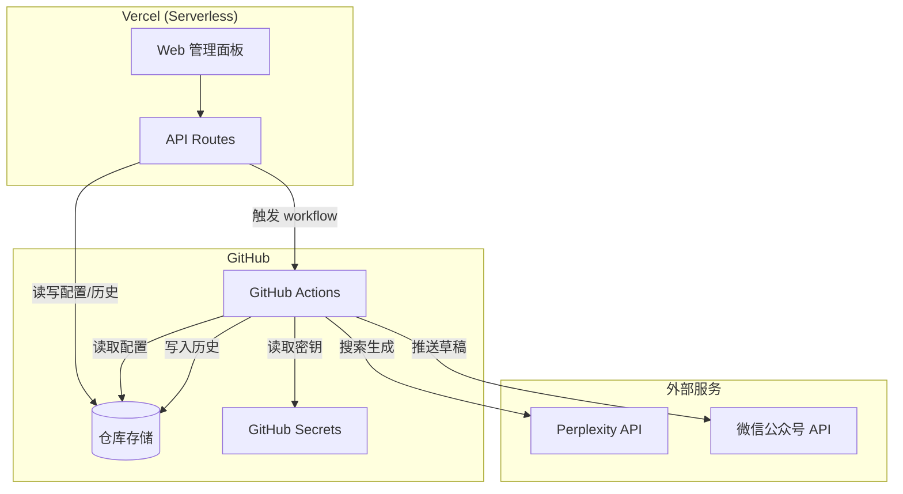

# 设计文档

## 概述

本系统是一个自动化内容聚合与发布平台，采用 Vercel + GitHub Actions 混合架构实现零服务器成本运营。系统核心流程：

1. **定时触发**: GitHub Actions 按 cron schedule 触发每日任务
2. **内容生成**: 调用 Perplexity API 搜索并生成 Perplexity 风格的每日摘要
3. **内容推送**: 将生成的内容推送到微信公众号草稿箱
4. **Web 管理**: Vercel 托管的管理面板提供配置管理和历史查看功能

## 架构



### 技术选型

| 组件 | 技术 | 说明 |
|------|------|------|
| Web 框架 | Next.js 14 (App Router) | Vercel 原生支持，SSR + API Routes |
| 前端 | React + Tailwind CSS | 快速构建响应式 UI |
| 运行时 | Node.js 20 | LTS 版本，GitHub Actions 支持 |
| 语言 | TypeScript | 类型安全 |
| 定时任务 | GitHub Actions | 免费 cron 调度 |
| 数据存储 | GitHub 仓库 JSON 文件 | 零成本，版本控制 |
| 认证 | JWT + Cookie | 简单安全 |
| 测试 | Vitest + fast-check | 单元测试 + 属性测试 |

## 组件与接口

### 1. 核心库模块 (`src/lib/`)

#### 1.1 Perplexity API 客户端 (`perplexity.ts`)

```typescript
interface PerplexityConfig {
  apiKey: string;
  model?: string;  // 默认 'sonar'
  maxRetries?: number;  // 默认 3
}

interface PerplexityResponse {
  content: string;
  citations: string[];
  usage: {
    promptTokens: number;
    completionTokens: number;
    totalTokens: number;
  };
}

interface PerplexityClient {
  search(prompt: string): Promise<PerplexityResponse>;
  validateApiKey(): Promise<boolean>;
}
```

#### 1.2 微信公众号 API 客户端 (`wechat.ts`)

```typescript
interface WeChatConfig {
  appId: string;
  appSecret: string;
}

interface WeChatArticle {
  title: string;
  content: string;  // HTML 格式
  digest: string;
  thumbMediaId: string;
}

interface WeChatClient {
  getAccessToken(): Promise<string>;
  uploadImage(imageBuffer: Buffer, filename: string): Promise<string>;  // 返回 media_id
  uploadArticleImage(imageUrl: string): Promise<string>;  // 返回微信图片 URL
  createDraft(articles: WeChatArticle[]): Promise<string>;  // 返回 media_id
}
```

#### 1.3 内容生成器 (`content.ts`)

```typescript
interface Topic {
  id: string;
  name: string;
  keywords: string;
  enabled: boolean;
}

interface GeneratedArticle {
  title: string;
  content: string;  // Markdown 格式
  htmlContent: string;  // HTML 格式（微信兼容）
  digest: string;
  citations: string[];
  tokensUsed: number;
}

interface ContentGenerator {
  generateDailySummary(topics: Topic[]): Promise<GeneratedArticle>;
  formatToHtml(markdown: string): string;
  buildPrompt(topics: Topic[]): string;
}
```

#### 1.4 GitHub API 客户端 (`github.ts`)

```typescript
interface GitHubConfig {
  token: string;
  owner: string;
  repo: string;
}

interface GitHubClient {
  getFile<T>(path: string): Promise<T | null>;
  updateFile<T>(path: string, content: T, message: string): Promise<void>;
  triggerWorkflow(workflowId: string): Promise<void>;
}
```

#### 1.5 认证模块 (`auth.ts`)

```typescript
interface AuthConfig {
  password: string;
  jwtSecret: string;
  tokenExpiry?: number;  // 默认 24 小时
}

interface AuthService {
  verifyPassword(input: string): boolean;
  generateToken(): string;
  verifyToken(token: string): boolean;
}
```

### 2. API Routes (`src/app/api/`)

| 路由 | 方法 | 功能 | 需求 |
|------|------|------|------|
| `/api/auth/login` | POST | 登录验证 | 10.1-10.3 |
| `/api/auth/logout` | POST | 退出登录 | 10.5 |
| `/api/topics` | GET | 获取主题列表 | 1.5 |
| `/api/topics` | POST | 添加主题 | 1.2 |
| `/api/topics/[id]` | PUT | 更新主题 | 1.3 |
| `/api/topics/[id]` | DELETE | 删除主题 | 1.4 |
| `/api/settings` | GET | 获取设置 | 2.2 |
| `/api/settings` | PUT | 更新设置 | 2.2 |
| `/api/history` | GET | 获取历史 | 7.1-7.3 |
| `/api/trigger` | POST | 触发 workflow | 2.3 |
| `/api/usage` | GET | 获取用量统计 | 3.1.4-3.1.5 |

### 3. 页面组件 (`src/app/`)

| 页面 | 路径 | 功能 |
|------|------|------|
| 登录页 | `/login` | 密码登录 |
| 仪表盘 | `/dashboard` | 概览、快捷操作 |
| 主题管理 | `/dashboard/topics` | CRUD 主题 |
| 设置 | `/dashboard/settings` | 定时、API 配置状态 |
| 历史 | `/dashboard/history` | 查看推送历史 |

### 4. GitHub Actions 脚本 (`scripts/`)

```typescript
// daily-publish.ts
async function main(): Promise<void> {
  // 1. 读取配置
  const topics = await readTopics();
  const settings = await readSettings();
  
  // 2. 生成内容
  const article = await generateContent(topics);
  
  // 3. 推送到微信
  const mediaId = await pushToWeChat(article);
  
  // 4. 更新历史
  await updateHistory(article, mediaId);
}
```

## 数据模型

### Topic（搜索主题）

```typescript
interface Topic {
  id: string;           // UUID
  name: string;         // 主题名称
  keywords: string;     // 搜索关键词
  enabled: boolean;     // 是否启用
  createdAt: string;    // ISO 时间
  updatedAt: string;    // ISO 时间
}
```

### Article（文章）

```typescript
interface Article {
  id: string;           // UUID
  title: string;        // 文章标题
  content: string;      // Markdown 内容
  htmlContent: string;  // HTML 内容
  digest: string;       // 摘要（100字以内）
  citations: string[];  // 来源链接
  status: 'generated' | 'pushed' | 'failed';
  mediaId?: string;     // 微信草稿 ID
  tokensUsed: number;   // API token 用量
  createdAt: string;    // 生成时间
  pushedAt?: string;    // 推送时间
  error?: string;       // 错误信息
}
```

### Settings（设置）

```typescript
interface Settings {
  schedule: {
    timezone: string;      // 时区，如 'Asia/Shanghai'
    preferredTime: string; // 首选时间，如 '08:00'
  };
  content: {
    language: string;      // 语言，如 'zh-CN'
    minLength: number;     // 最小字数，默认 1500
    maxLength: number;     // 最大字数，默认 2500
  };
}
```

### History（历史记录）

```typescript
interface History {
  articles: Article[];
  usage: {
    totalTokens: number;   // 累计 token
    totalCost: number;     // 累计成本（美元）
    lastReset: string;     // 上次重置时间
  };
}
```

### TopicsConfig（主题配置文件）

```typescript
interface TopicsConfig {
  topics: Topic[];
}
```


## 正确性属性

*属性是一种应该在系统所有有效执行中保持为真的特征或行为——本质上是关于系统应该做什么的形式化陈述。属性作为人类可读规范和机器可验证正确性保证之间的桥梁。*

### Property 1: 主题 CRUD 往返一致性

**对于任意**主题数据，执行添加、读取、更新、删除操作后，系统状态应保持一致：
- 添加主题后，读取应返回包含该主题的列表
- 更新主题后，读取应返回更新后的数据
- 删除主题后，读取应返回不包含该主题的列表

**Validates: Requirements 1.2, 1.3, 1.4, 1.5**

### Property 2: Perplexity API 响应解析正确性

**对于任意**有效的 Perplexity API 响应 JSON，解析函数应正确提取：
- `choices[0].message.content` 作为内容
- `citations` 数组作为来源链接
- `usage` 对象中的 token 统计

**Validates: Requirements 3.4**

### Property 3: 指数退避重试策略

**对于任意** API 调用失败序列，重试机制应：
- 最多重试 3 次
- 每次重试间隔按指数增长（如 1s, 2s, 4s）
- 最终失败时抛出包含所有尝试信息的错误

**Validates: Requirements 3.5**

### Property 4: 多主题合并为单次 API 调用

**对于任意**启用的主题列表（1-10 个），prompt 构建函数应将所有主题合并到单个请求中，而不是发起多次 API 调用。

**Validates: Requirements 3.1.1**

### Property 5: Token 用量记录完整性

**对于任意** API 调用，系统应从响应中提取并累加 token 使用量到历史记录，且累计值应等于所有单次调用的总和。

**Validates: Requirements 3.1.3**

### Property 6: 预算警告阈值判断

**对于任意**累计用量值，当超过预算（$5）的 80%（即 $4）时，`shouldShowWarning` 函数应返回 `true`，否则返回 `false`。

**Validates: Requirements 3.1.5**

### Property 7: 内容格式验证

**对于任意**生成的文章内容，应满足以下格式要求：
- 包含一个主标题
- 包含 3-5 个编号章节
- 每个章节末尾包含来源引用链接
- 总字符数在 1500-2500 之间
- 开头包含 50-100 字的引言段落

**Validates: Requirements 4.1, 4.2, 4.3, 4.4, 4.5**

### Property 8: 微信文章数据结构完整性

**对于任意**生成的文章，转换为微信 API 格式后应包含所有必需字段：
- `title`: 非空字符串
- `content`: 有效 HTML
- `digest`: 100 字以内的摘要
- `thumb_media_id`: 有效的素材 ID

**Validates: Requirements 5.2**

### Property 9: 文章状态转换正确性

**对于任意**文章状态转换：
- 初始状态为 `generated`
- 推送成功后状态变为 `pushed`，且 `mediaId` 非空
- 推送失败后状态变为 `failed`，且 `error` 非空

**Validates: Requirements 5.4, 5.5**

### Property 10: 外部图片 URL 替换

**对于任意**包含外部图片 URL 的 HTML 内容，处理后所有 `` 标签的 `src` 属性应指向微信域名（`mmbiz.qpic.cn`）。

**Validates: Requirements 5.6**

### Property 11: 微信错误码映射

**对于任意**微信 API 错误码，系统应返回对应的中文错误描述：
- 40013 → "AppID 无效"
- 40125 → "AppSecret 无效"
- 40001 → "access_token 无效或过期"

**Validates: Requirements 6.4**

### Property 12: access_token 失效重试

**对于任意**返回错误码 40001 的微信 API 调用，系统应：
1. 重新获取 access_token
2. 使用新 token 重试原请求
3. 最多重试 1 次

**Validates: Requirements 6.5**

### Property 13: 历史记录持久化一致性

**对于任意**文章生成和推送操作，历史记录应：
- 包含所有已生成文章
- 每条记录包含标题、时间、状态
- 写入文件后再次读取应返回相同数据

**Validates: Requirements 7.1, 7.2, 7.5**

### Property 14: 默认配置初始化

**对于任意**不存在的配置文件路径，读取操作应返回预定义的默认配置，而不是抛出错误。

**Validates: Requirements 9.4**

### Property 15: JWT 认证正确性

**对于任意**密码输入：
- 正确密码应生成有效的 JWT token
- 错误密码应被拒绝
- 过期的 token（超过 24 小时）应验证失败
- 有效的 token 应验证成功

**Validates: Requirements 10.2, 10.3, 10.4**

## 错误处理

### 错误类型层次

```typescript
// 基础错误类
class AppError extends Error {
  constructor(
    message: string,
    public code: string,
    public statusCode: number = 500,
    public retryable: boolean = false
  ) {
    super(message);
    this.name = 'AppError';
  }
}

// Perplexity API 错误
class PerplexityApiError extends AppError {
  constructor(message: string, statusCode: number, retryable: boolean) {
    super(message, 'PERPLEXITY_ERROR', statusCode, retryable);
    this.name = 'PerplexityApiError';
  }
}

// 微信 API 错误
class WeChatApiError extends AppError {
  constructor(message: string, public errcode: number) {
    const retryable = errcode === 40001; // access_token 过期可重试
    super(message, 'WECHAT_ERROR', 400, retryable);
    this.name = 'WeChatApiError';
  }
}

// GitHub API 错误
class GitHubApiError extends AppError {
  constructor(message: string, statusCode: number) {
    const retryable = statusCode >= 500;
    super(message, 'GITHUB_ERROR', statusCode, retryable);
    this.name = 'GitHubApiError';
  }
}

// 认证错误
class AuthError extends AppError {
  constructor(message: string) {
    super(message, 'AUTH_ERROR', 401, false);
    this.name = 'AuthError';
  }
}
```

### 错误处理策略

| 错误类型 | 处理策略 | 用户反馈 |
|----------|----------|----------|
| Perplexity API 超时 | 指数退避重试 3 次 | 显示重试进度 |
| Perplexity API 401 | 终止执行 | 提示检查 API 密钥 |
| 微信 API 40001 | 刷新 token 重试 | 自动处理 |
| 微信 API 其他错误 | 记录错误，标记失败 | 显示错误码和描述 |
| GitHub API 404 | 创建默认配置 | 自动处理 |
| GitHub API 其他错误 | 重试或报错 | 显示错误信息 |
| JWT 验证失败 | 重定向登录 | 提示重新登录 |

## 测试策略

### 单元测试（Vitest）

单元测试覆盖以下模块：

1. **内容生成器** (`content.ts`)
   - prompt 构建逻辑
   - Markdown 到 HTML 转换
   - 字符数统计

2. **认证模块** (`auth.ts`)
   - 密码验证
   - JWT 生成和验证

3. **数据转换**
   - 主题数据验证
   - 文章状态转换
   - 错误码映射

### 属性测试（fast-check）

使用 fast-check 库进行属性测试，验证以下正确性属性：

| 属性 | 测试策略 | 生成器 |
|------|----------|--------|
| Property 1 | 生成随机主题，执行 CRUD，验证一致性 | `fc.record({ name: fc.string(), keywords: fc.string() })` |
| Property 2 | 生成随机 API 响应结构，验证解析 | 自定义 Perplexity 响应生成器 |
| Property 3 | 模拟失败序列，验证重试次数和间隔 | `fc.array(fc.boolean())` |
| Property 4 | 生成 1-10 个主题，验证合并为单次调用 | `fc.array(topicArb, { minLength: 1, maxLength: 10 })` |
| Property 5 | 生成多次 API 调用的 usage，验证累加 | `fc.array(fc.nat())` |
| Property 6 | 生成 0-10 范围的用量值，验证阈值判断 | `fc.double({ min: 0, max: 10 })` |
| Property 7 | 生成文章内容，验证格式约束 | 自定义文章生成器 |
| Property 8 | 生成文章数据，验证微信格式转换 | 自定义文章生成器 |
| Property 9 | 生成状态转换序列，验证状态机 | `fc.oneof(fc.constant('success'), fc.constant('failure'))` |
| Property 10 | 生成包含外部图片的 HTML，验证替换 | 自定义 HTML 生成器 |
| Property 11 | 生成微信错误码，验证映射 | `fc.constantFrom(40013, 40125, 40001)` |
| Property 12 | 模拟 40001 错误，验证重试行为 | 固定场景 |
| Property 13 | 生成文章列表，验证持久化往返 | `fc.array(articleArb)` |
| Property 14 | 生成不存在的路径，验证默认配置 | `fc.string()` |
| Property 15 | 生成密码和 token，验证认证流程 | `fc.string()` |

### 测试配置

```typescript
// vitest.config.ts
export default defineConfig({
  test: {
    globals: true,
    environment: 'node',
    include: ['tests/**/*.test.ts'],
    coverage: {
      provider: 'v8',
      reporter: ['text', 'json', 'html'],
    },
  },
});
```

### 属性测试迭代次数

每个属性测试配置运行 100 次迭代，确保覆盖足够的输入空间：

```typescript
fc.assert(
  fc.property(generator, (input) => {
    // 属性验证逻辑
  }),
  { numRuns: 100 }
);
```
